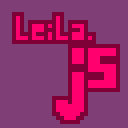

  

# Leila.js

*A mini lib to build games for the Web*

Leila.js est une petite librairie déstinée à la programmation de jeux pour le web.
Très légère et simple d'utilisation, Leila.js se veut être un outil de choix pour
les *game jams* ou le prototypage.

Au terme de son développement elle devra fournir les fonctionnalités suivantes :
+ rendu 2D / 3D
+ audio et son
+ gestion des entrées périphériques
+ gestion de scènes de jeu ou d'état

# Note

Il semble important de rappeler que Leila.js est un projet à but éducatif.
C'est une bibliothèque réalisée avant tout par des débutants et des passionnés
de programmation. Elle n'est donc pas déstinée à un usage "professionnel".

Cependant, elle est réalisée avec le soucis d'être fonctionnelle, légère et propre.
Si vous repérez d'éventuelles optimisations possibles, n'hésitez pas à le faire savoir et à contribuer au projet !

L'objectif de leila.js reste avant tout de rassembler une communauté de développeurs de
tout âge et de tout niveau autour d'un même projet collaboratif.

# Stade du développement

Leila.js est actuellement en période de test/développement.

Quoi de mieux pour avancer dans le développement que de commencer
à utiliser Leila.js ? Pour être certain de proposer des fonctionnalités 
pratiques et simples d'utilisation, nous développons Leila.js tout en 
l'utilisant dans des projets.

Le jeu [dungeonJam](https://github.com/jdrprod/dungeonJam) utilise
déjà les dernières fonctionnalités de Leila.js.

### fonctionnalités disponibles

+ gestion de scènes (states)
+ gestion des entrées clavier
+ chargement des scènes et des images
+ dessin de primitives 2D et images

### fonctionnalités instables / en développement

+ création de 'gameObjects'
+ optimisation du rendu des gameObjects via .setState()
	+ un gameObject n'est rendu que si son état a changé
+ gestion des formats d'images
+ groupes de gameObjects

### fonctionnalités à ajouter

+ entrées souris
+ gestion des assets (json, son, etc)
+ rendu 3D
+ multi canvas

Pour prendre part au développement, vous pouvez rejoindre le server discord suivant : 
[discord](https://discord.gg/kv9zA3Z)

# Le langage et les outils

Leila.js est, comme indiqué par son nom, développée en javascript.
Pour accelérer le développement et permettre une orgnaisation en modules, Leila.js est conçue sous Node.js.
On utilise également browserify pour packager la librairie en un seul fichier utilisable dans n'importe quelle page web.

# Packager la bibliothèque

Pour packager la bibliothèque après lui avoir aporter d'éventuelles modifications, il existe deux options :

La commande `$ npm run build` produit une version complète de la bibliothèque
à l'emplacement **build/leila.js**  

La commande `$ npm run buildCore` produit une version allégée de la bibliothèque
à l'emplacement **build/leila_core.js**

Vous pouvez ensuite importer ce `leila(_core).js` dans n'importe qu'elle balise `<script>`.

*test push master*
